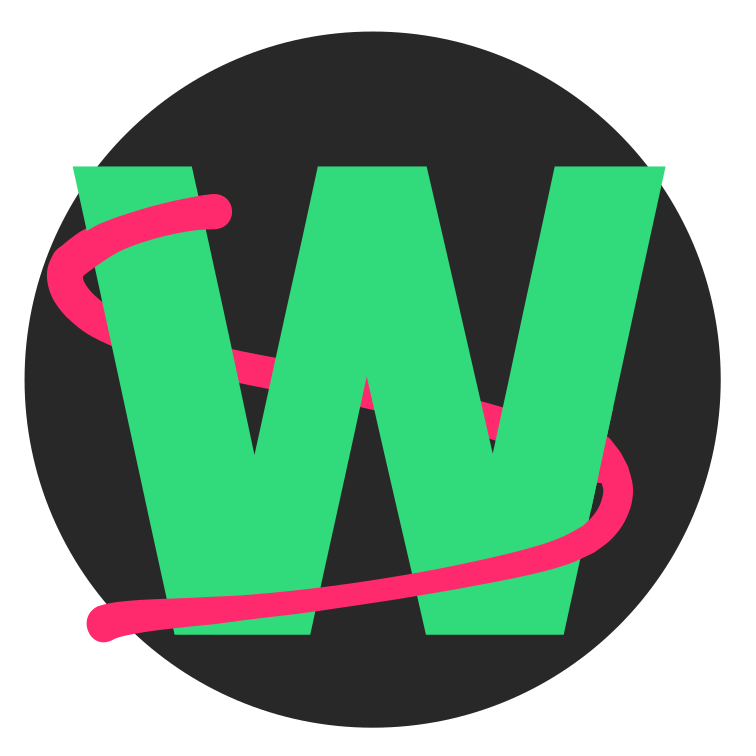
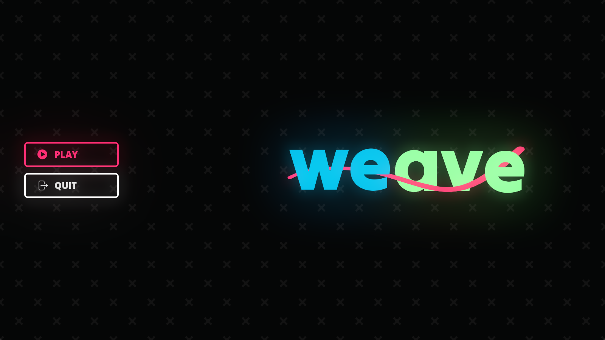
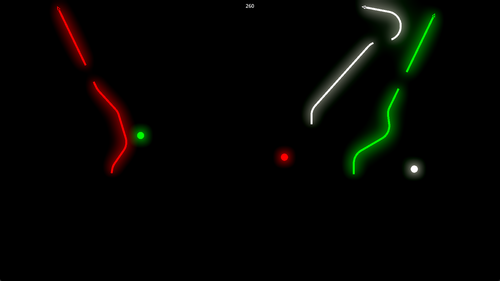

# weave 🧵🕹️ (Game) [](https://sonarcloud.io/summary/new_code?id=weave-game_weave)

<div align="center">
  
</div>

- [weave 🧵🕹️ (Game) ](#weave-️-game-)
  - [About](#about)
    - [Gameplay](#gameplay)
  - [Formatting](#formatting)
    - [CLI](#cli)
    - [Plugins](#plugins)

## About

Steer your line without crashing into each other, work together to get the highest score.

A game made in the Game Development Project course at Chalmers/GU.

<center>
  <table>
    <tr>
      <td>
        
      </td>
      <td>
        
      </td>
    </tr>
    <tr>
      <td>Start screen</td>
      <td>Gameplay</td>
    </tr>
  </table>
</center>

### Gameplay

[](https://youtu.be/Fw0T2zQHsvo?si=y7i0zsi_a19gQXTo)

## Formatting

The project uses [EditorConfig](https://editorconfig.org/) and [Roslynator](https://github.com/dotnet/roslynator) to enforce code style. This allows formatting and analysis independent of IDE.

### CLI

Install:

```bash
dotnet tool install -g roslynator.dotnet.cli
```

Analyze project (inside the weave directory):

```bash
roslynator analyze .\Weave.sln
```

Fix and format project (inside the weave directory):

```bash
roslynator fix .\Weave.sln --format
```

### Plugins

- Install [Roslynator](https://marketplace.visualstudio.com/items?itemName=josefpihrt-vscode.roslynator) plugin for VSCode (or your preferred IDE).
- Install [EditorConfig](https://marketplace.visualstudio.com/items?itemName=EditorConfig.EditorConfig) plugin for VSCode (or your preferred IDE).
